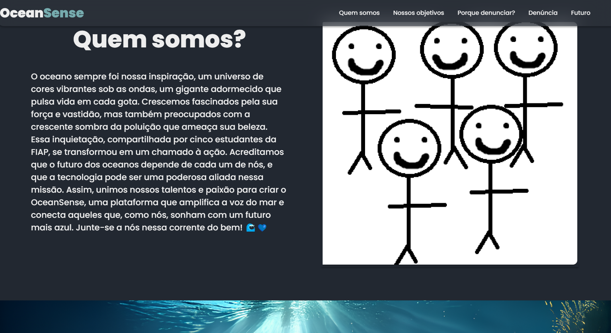

<h1 align = "center"> OceanSense <h1>
<h2 align = "center"> By Bieelx <h2>

Este repositório contém o código do front-end para o projeto Global Solution, desenvolvido para a FIAP em colaboração com um grupo de 4 alunos, sendo eu o responsável pelo desenvolvimento do front-end. 

## 🚀 Tecnologias

Esse projeto foi desenvolvido com as seguintes tecnologias:
- React
- JavaScript
- CSS
- Figma

## 💻 Projeto
Este repositório apresenta o front-end de um projeto inovador que visa combater a poluição através de denúncias anônimas. O site oferece uma plataforma segura e fácil de usar para que qualquer pessoa possa reportar casos de poluição ambiental, contribuindo para a proteção do nosso planeta. O projeto, desenvolvido em colaboração com um grupo de 4 alunos, sendo eu o responsável pelo desenvolvimento do front-end e os demais alunos responsáveis pelo backend, está em constante evolução. A próxima etapa inclui o desenvolvimento de um chip com inteligência artificial (IA) que analisará a temperatura e o pH da água, enviando relatórios para as autoridades em caso de anomalias. Essa tecnologia proporcionará um monitoramento mais eficiente e preciso, garantindo uma resposta rápida e eficaz a problemas de poluição. O backend do projeto será desenvolvido em Java e MySQL, com integração com o WhatsApp para facilitar a comunicação e o recebimento de denúncias. Juntos, podemos fazer a diferença! Ajude-nos a construir um futuro mais limpo e sustentável. Acesse nosso site e faça sua denúncia.
